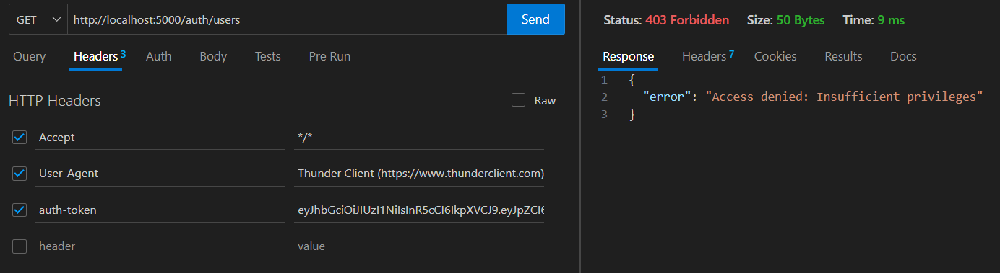
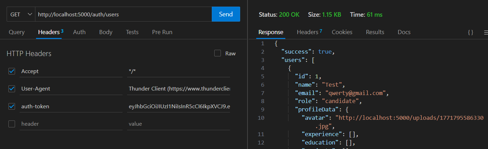
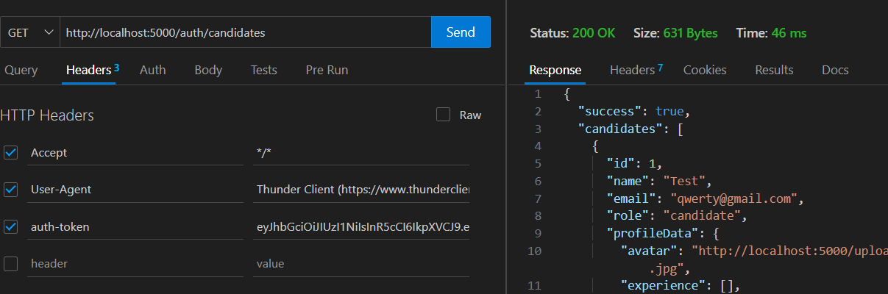
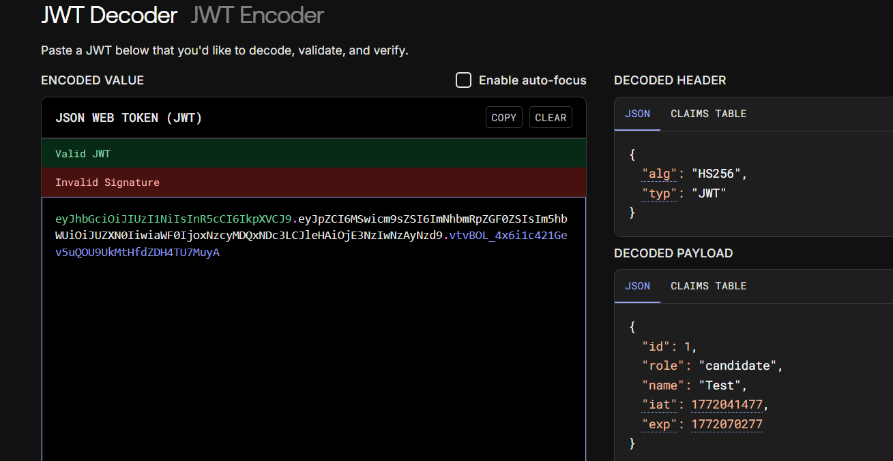
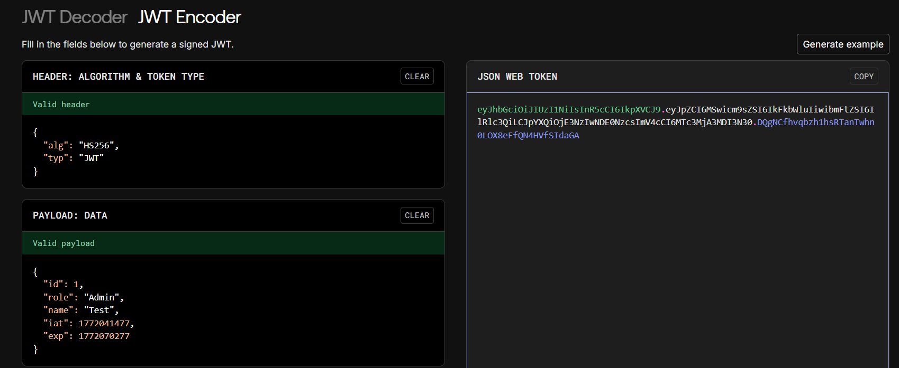
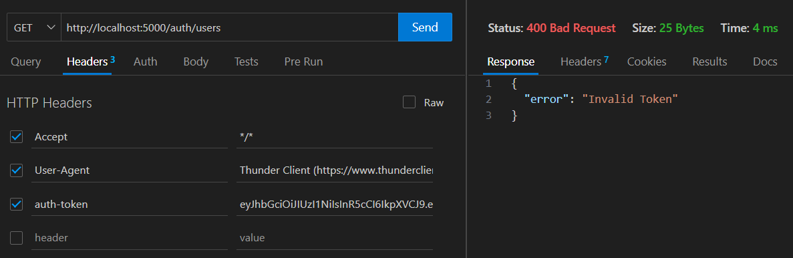

# CV Platform - Secure RBAC System 
The idea for this project is to create a **CV platform** with Role-Based Access Control (RBAC) system. 

It ensures secure data management and profile visualization for candidates and recruiters who are going to be the users of the platform.

For the project, the tools used were:

* ExpressJS
* Sequelize 
* PostgreSQL
* React


##  Running the project

To setup, the global script that I created, it has been implemented at the project root `/cv-platform` with the file *package.json*.

### 1. Installation
The project has the part of the Client and Server, for running everything, there is the following command:
```bash
cd cv-platform
npm run install:all
npm install
```

### 2. Application

Starting the Backend and Frontend with the next command:

```bash
cd cv-platform
npm start
```

### Host
* **Frontend**: `http://localhost:3000`
* **Backend API**: `http://localhost:5000`

## Prerequisites

### Requirements

* **Node.js**.
* **PostgreSQL**, we need to edit the `server/config/config.json` for the database.

### Database Configuration

The project uses **Sequelize ORM**. It will synchronize and create the tables upon server startup without any modification of the database.

1. Create a PostgreSQL database (e.g., `cv_platform_db`).
2. Navigate to `server/config/config.json`.
3. Update the `username`, `password`, and `database` fields with your credentials.


## RBAC

The system handles access through secure middlewares, for that case, I used JWT Token verification with the Role validation for testing every breach of security.
Here, there are the roles that exist on the project:

* **Candidate**: Can register, log in, manage their professional profile (including photo upload), and receive notifications.
* **Recruiter**: Can browse the talent directory, filter candidates by skills/name, and send contact interests, also they can edit the profile.
* **Admin**: Full access to all the users in the platform.

### Security Features

* **Password Hashing**: There is `bcryptjs` with the User model.
* **Token Security**: JWT-based authentication.
* **File Uploads**: Secure image handling using `Multer` with a specific storage.
* **API**: Using Axios instance.

## Structure

* `/client`: React.js Frontend.
* `/server`: Node.js/Express Backend.
* `/server/uploads`: Local storage for profile pictures.

## Testing RBAC

- Using a token for a user "Candidate" trying to show all the users


- Now, when we are the admin, it shows all the user's information


- A recruiter searching all the candidates users


- If we trying to use the token of one candidate with this webpage `jwt.io`

    And then we edit the token to force to be a "Admin"
    
    The server blocked the request `400 Bad Request - Invalid Token` because the cryptographic signature no longer matched
    

**Conclusion**: The RBAC system is fully secure and impenetrable after the differents tests.

## What's next?
The idea for the future is to implement this project for a portfolio CV, with an interface featuring lots of animations that will appeal to all audiences, which I can use to present my projects and my profile in general.
